# Using the pipeline

This pipeline provides a thin wrapper around [pyraf](http://www.stsci.edu/institute/software_hardware/pyraf), which in turn is a thin wrapper around IRAF.  Accordingly, IRAF documentation for functions like `doslit`, `autoidentify`, `standard`, and `sensfunc` may be helpful to understand the command options. Search [here](http://stsdas.stsci.edu/gethelp/HelpSys.html) for IRAF function documentation.

You can obtain thorough help on any of the DBSP pipeline commands defined in this package with `help()`, e.g., `help(extract1D)`.

For help on IRAF commands, explore some of the following options:
Click graphics window, hit `?`
For window commands: click graphics window, type `w ?`.
For function documentation, type at the `ipython` prompt:

	iraf.help('doslit')
	iraf.dir('onedstds$')
	iraf.type('onedstds$README') (or iraf.page)
	iraf.epar('doslit')

`mark_bad()`:

All image files are uniquely identified by their `imgID` (an integer number) and the spectrograph arm (`side='red'` or `'blue'`), e.g., `red0018.fits`.  Most functions expect either a single `imgID` or a python list.

`create_arc_dome()`:

This command should operate automatically and generate several calibration products in the current directory.

After running, look at the flats (e.g, `flat_blue_1.0.fits`, `raw_flat_blue_1.0.fits`) in ds9 before continuing to make sure they don't have any weird features.  While rare, these issues are typically the result of science exposures being incorrectly detected as dome flats due to header keyword problems.

## Telluric correction for the red side
For basic telluric correction on the red side, first extract an appropriate telluric calibrator, then pass it to `store_standards` and
`extract1D`. See below how to perform `extract1D` and `store_standards`, where the description of `store_standards` includes all the step for
`extract1D`.

	extract1D(77, side='red', flux=False)

	store_standards([41, 42,43], side='red', telluric_cal_id = 77)

	extract1D(63, side='red', flux=True, telluric_cal_id = 77)

Note that the telluric_cal_id should be specified for all sources. 
		
## Store standards

`store_standards()`:

This function extracts 1D spectra for the standard star exposures using `extract1D()`, so review the key commands below.

`extract1D()`:

This function is a convenience wrapper for IRAF's `doslit` and several other functions.  The pipeline loads a modified version of `doslit` to minimize unneeded interactivity.  

If you set `quicklook='yes'`, it will proceed without any intervention.  The default, `quicklook='no'`, prompts you to identify and fit the trace and fit the dispersion function.  This requires you to know which key commands the IRAF graphics window is expecting.  [This tutorial](http://www.twilightlandscapes.com/IRAFtutorial/IRAFintro_06.html) provides some guidance, and the discussion below identifies the most important.

When IRAF is waiting for your input in the graphics window, you can type `?` to get a list of the commands.  Some of these will begin with a colon, meaning that you can change a value by clicking on the gray bar in the bottom of the graphics window and typing something like `:function spline3`.  Typically once you are satified with a given selection you type `q` to accept and continue. 

Note that commands in the graphics window may require you to click to focus; then you may have to click back to type responses in the terminal.

The first screen (shown below) allows you to edit the aperture for extracting the spectrum.  

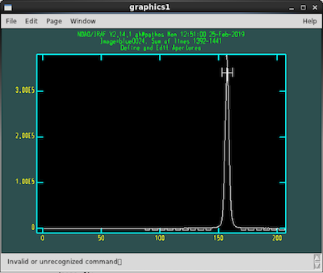

* Use `d` to delete trace, `m` to set it
* `l` to set the lower limit for the aperture
* `u` to set the upper limit for the aperture
* `b` to enter background editing
* `z` to delete background intervals
* `s` `s` (with cursor positions) to mark new fit regions for the backgorund.
* `f` to fit
* `q` to quit

We expect to find the peak around pixel number 150 on the blue side, pixel number 50 on the red side.  The pipeline considers the brightest object to be the target,
however this is not necessarily true!  Especially in this case, make sure that you replace the aperture using `d` and `m`.  Also, modifying the background may be
necessary.  In the example below, a very steep background choice can help reduce galaxy light contamination (brightest peak) during the extraction of a supernova
spectrum (sharpest peak).
 
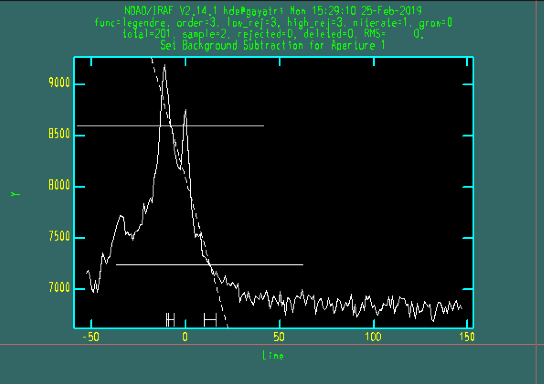

After you have pressed 'q' to quit, you will be presented with an option to confirm;
the default is 'yes'. You can just press enter. You will have to click enter twice.

The second screen (shown below) allows you to fit the trace interactively using IRAF's `icfit`:
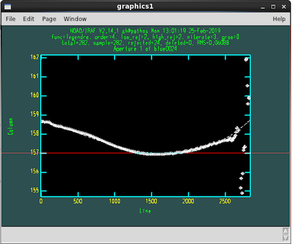

* `?` for help
* `:order #` to change fit order.  Default of 4 is probably fine; don't worry too much about excursions on the faint ends of the trace
* `d` to delete any points biasing the fit.  The flux is usually faint at the end, so if this does not
bias the fit too much don't bother deleting the points. 
* `s` (twice) to change the sampling region (e.g., to exclude faint ends)
* `f` to refit
* `q` to quit

Aim for RMS < 0.07 or so.  Note that points marked with diamonds are already ignored during the fit, as they are
automatically flagged as outliers. 

The next screen (see below) lets you fit the wavelength solution with IRAF's `autoidentify` and `reidentify`:

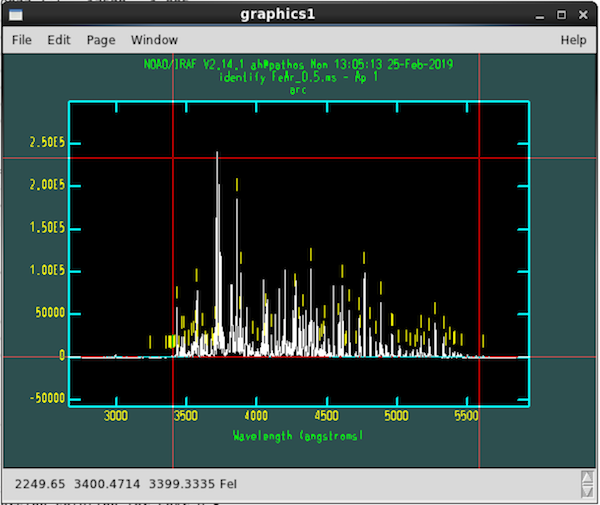

* `f` to fit/refit

Once you pressed `f`, here is what the screen should look like (blue side!)
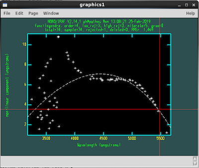

The next step is to remove outlier points,
then add the full line list back in.

To improve the fit:

* `j` to switch to residuals plot
* `l` to go back to the previous view (after having pressed `j`)
* `d` to delete outliers (Note: blue side is often bad below 4000, delete those points)
* `f` ro re-fit (good values for the fit are <0.07 RMS)
* iterate between `d` and `f` until you are satisfied
* `q` to save solution.
* when you have the line view back, press `l` to add lines back in
* press `j` to view the new residuals plot (RMS will be slightly higher)
* if you are happy, press `q` to quit and save solution. 

If you have to (or want to) manually identify lines:

* `w x` to zoom in
* `m` to specify a line (with cursor hovering over it): enter the wavelength in angstroms
* `w a` to zoom out

do it for a second line (may already be identified)

* `f` to fit
* `d` to delete outliers
* `l` or `y` to ask for more lines
* `f` to fit again
* `q` twice to save solution

The result of the above steps should look similar to the image below:
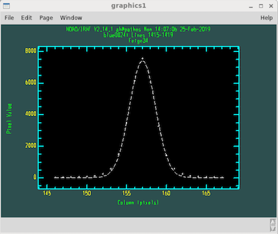

The process above (choose aperture, fit trace, fit/verify dispersion solution) occurs each time you run `extract1D()`.  If the extraction is part of the `store_standards()` call, you'll then continue with the following prompts:

The terminal will prompt: `change wavelength coordinate assignments?`
This is your chance to set wavelength range & binning: type `yes`.
Sensible defaults (assuming the 600/4000 grating on the blue side and 316/7500 grating on the red): 

	5500-10000, 1.525 red (new red camera)
	5500-7800, 2.47 red (old red camera)
	3400-5700, 1.07 blue (advanced: you can push to bluer wavelengths, for example 3200, if your target is particularly blue
	and if you know well how to deal with sensitivity function blowing up at the bluest end)
	
Accept the suggested number of output pixels, then say `no` when it asks you again if you want to change them.

You will be prompted back to the wavelength calibration window.  Once again, press `l` to add lines, `f` to
fit, `j` to see the residuals (and from here `l` to see the fit), `d` to remove outliers, and `f` to refit.  Press `q` twice to move on to the next
step. 

Next, you will be prompted to naming the output sensitifity function files.  You can press `enter` and accept the default names. 

Extinction files: indicate the extinction file name if you wish to use it.  If not (default practice) leave blank and press `enter`.

Next, you'll fit throughput functions for the standards; this uses IRAF's `standards`.	

* `?` for list or `iraf.page('onedstds$README')` 

all of the commonly-used ones are in `onedstds#iidscal`:
	
	g191b2b
	feige34
	bd332642
	bd284211
	
edit bandpasses - say `yes` to enter bandpasses editing.  What you do next depends on whether you are processing the red or blue side

## Blue side bandpasses
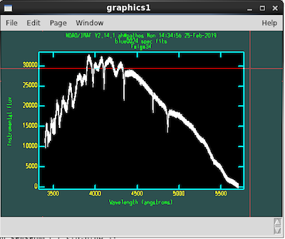

use 'd' to delete bandpasses. In this step, you want to remove all bandpasses associated with the Balmer series of absorption lines, as well as those associated with
helium lines, when these are present (in particular, He I 4471 and He II 4686). We remove these lines, because when fitting out the artifacts in the flux of the standard, we do not want to fit out real features of the standard (as this
would artificially introduce emission lines at these wavelengths).  Below are examples of what a correctly removed line looks like, and what the whole spectrum with
removed lines looks like.

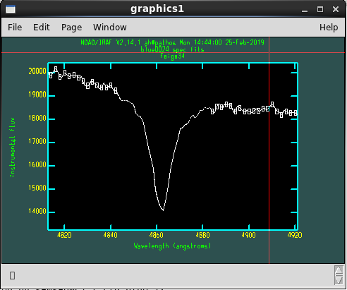
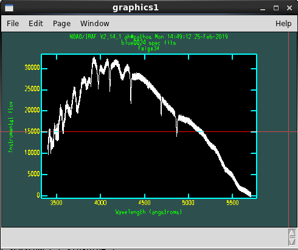

When you are done, press `q` and then `enter` (4 times).

## Red side bandpasses 

The most common lines and tellurics are already automatically deleted.  Check the wings of the lines to check if more points must
be deleted. Also, check if other absorption features are deleted (usually Balmer lines and He lines). 

* `a` `a` (with mouse pointer at two positions) to place new bands
* `d` to delete bands (on absorption features, say)
* `q` to quit and save

Below is an example of what a spectrum with automatically removed lines looks like.
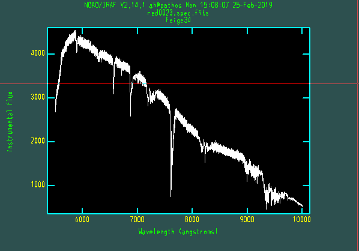

## Both red and blue sides

You'll define bands for all of your standard exposures, then fit the sensitivity function with IRAF's `sensfunc`.

* `?` for help
* `s` over graphs to eliminate mean shifts due to non-photometric conditions (toggles)
* `d` to delete bad points
* `a` to add points (this is important in case the points are over-fitted and the function "explodes" at the sides or where lines were deleted)
* `o` Change the order of the fit. IMPORTANT: Use very high order on the blue side, around 100. On the red side, use order <20 if the
spectrum arrives to 10000AA, otherwise an higher order can be used if stopping at about 8900AA. 

Make sure the fitted function doesn't go up after the last points--it will blow up the noise.  Especially on the red side, add points to go all the way to 10000AA! 

After completing the above steps, the sensitivity function will be defined and you'll be ready to obtain science spectra using `extract1D()`.

`combine_sides()`:

This function combines data from the two spectrograph arms; it can also coadd data in an uncertainty-weighted manner.  The output filenames are taken from the `OBJECT` header keyword.

## Reduce science targets 

For science objects, follow the same steps described for `store_standards` until the editing of bandpasses. 
	extract1D(61, side='blue', redo='yes')
With telluric correction:
	extract1D(61, side='red', flux=True, telluric_cal_id=77)

# Sample data
Raw DBSP data for two public spectra can be found in `sample_data.tar.gz`, one with a substantial host background and one without. You can use these to practice reducing, following the observing log notes below:
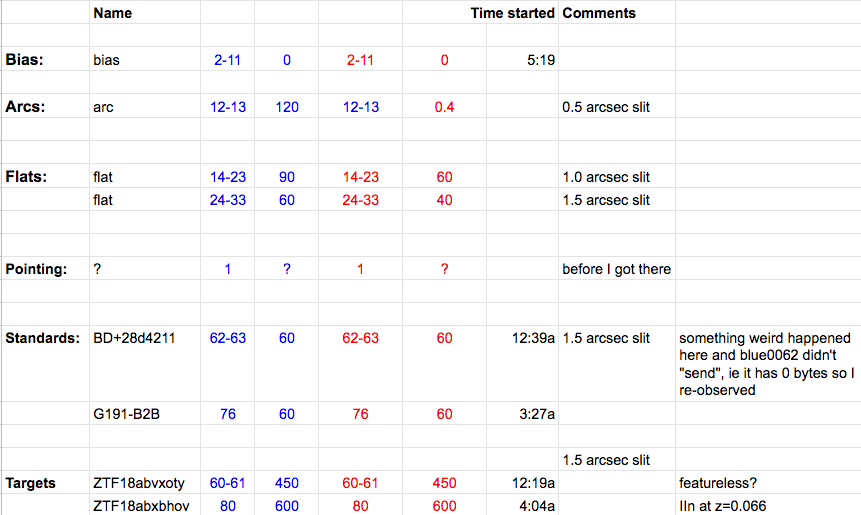

# Tips for on the fly reduction

Start reducing data after you have taken your first standard star exposure.

Copy (or `rsync`) new data into your `raw` subdirectory; then call `sync()` to 	bring the new files into your working directory without overwriting 	those you've already processed.

You can set `quicklook=yes` in `extract1D` to skip manual identification and fitting of the trace and dispersion.  Use with caution, particularly with faint sources.
